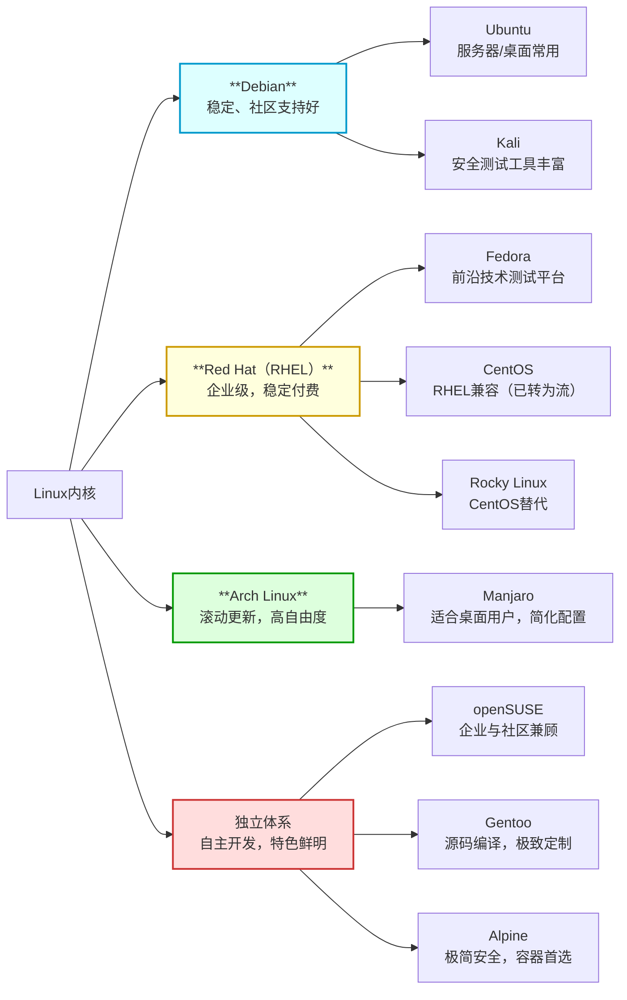
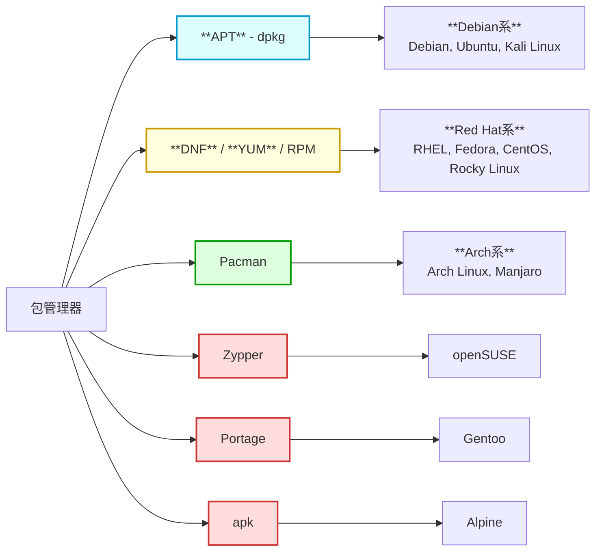
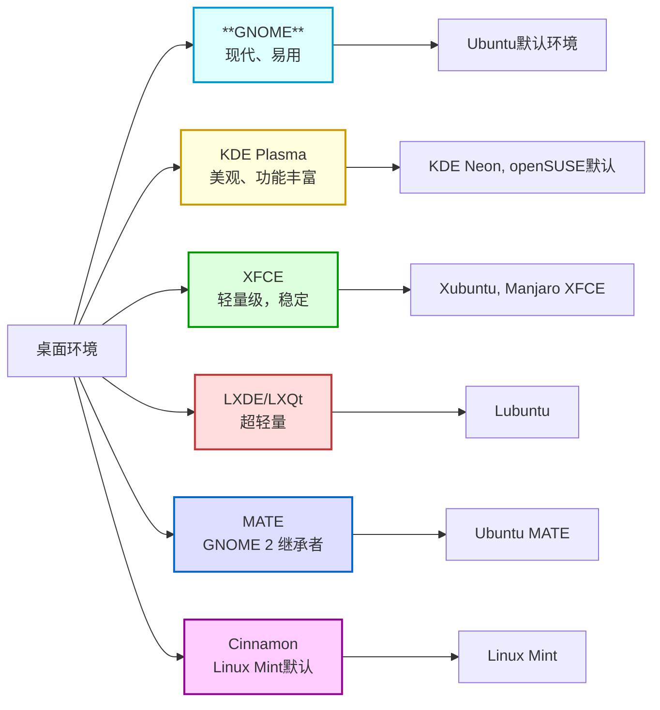

# 搭建Linux环境
## 搭建方式
Linux 是互联网应用的基础，广泛用于服务器与服务搭建。常见的环境搭建方式有：**云服务器、虚拟机和容器化**，它们虽都提供可用的 Linux 环境，但在搭建方式、资源消耗和适用场景上各有区别。
### ☁️ 云服务器
> 通过云服务平台<u>租用远程 Linux 主机</u>，开箱即用，适合生产部署和远程协作。

**🌍 国际**
1. **[亚马逊 AWS](https://aws.amazon.com/)** 
2. **[微软 Azure](https://azure.microsoft.com/)
3. **[谷歌云 (Google Cloud Platform)](https://cloud.google.com/)** 
4. **[甲骨文云 (Oracle Cloud)](https://www.oracle.com/cloud/)** 
5. **[IBM 云](https://www.ibm.com/cn-zh/cloud)**
---
**🇨🇳 中国**
1. **[阿里云](https://www.aliyun.com/)** 
2. **[腾讯云](https://cloud.tencent.com/)
3. **[华为云](https://www.huaweicloud.com/)**  
4. **[百度云](https://cloud.baidu.com/)** 
5. **[七牛云](https://www.qiniu.com/)** 
### 💻 虚拟机
> 通过虚拟机软件直接在本地安装运行 Linux，环境独立，占用资源大，适合学习使用。

**常见虚拟化软件**
1. **[VMware](https://www.vmware.com/)**
2. **[VirtualBox](https://www.virtualbox.org/)** 
3. **[Hyper-V](https://learn.microsoft.com/en-us/virtualization/hyper-v-on-windows/)**
4. **[KVM](https://www.linux-kvm.org/)** 
5. **[Parallels Desktop](https://www.parallels.com/)**
### 🐳 容器化
> 基于容器技术，共享宿主机内核，启动速度快，资源占用少。

**主流容器工具**
1. [Docker](https://www.docker.com/)
2. [OrbStack](https://orbstack.dev/)
3. [Podman](https://podman.io/)
4. [Kubernetes](https://kubernetes.io/)
## 版本选择
### 🧬 内核版本
官方内核站点：[https://www.kernel.org/](https://www.kernel.org/)
### 🏷️ Linux 发行版本
> “发行版”是在内核基础上，附带了包管理器、系统服务、桌面环境、文档和社区支持的一整套操作系统。

**[Linux发行版时间线](https://upload.wikimedia.org/wikipedia/commons/a/ad/2023_Linux_Distributions_Timeline.svg)**
#### 体系分类（三大主流）

**✅ 建议学习顺序：**
1. **Ubuntu 24.04 LTS**：入门基础命令、目录结构、服务管理等。
2. **Rocky Linux 9**：进阶企业部署标准，理解 RHEL/Debian 差异。
#### 包管理器对比

#### 桌面环境对比

